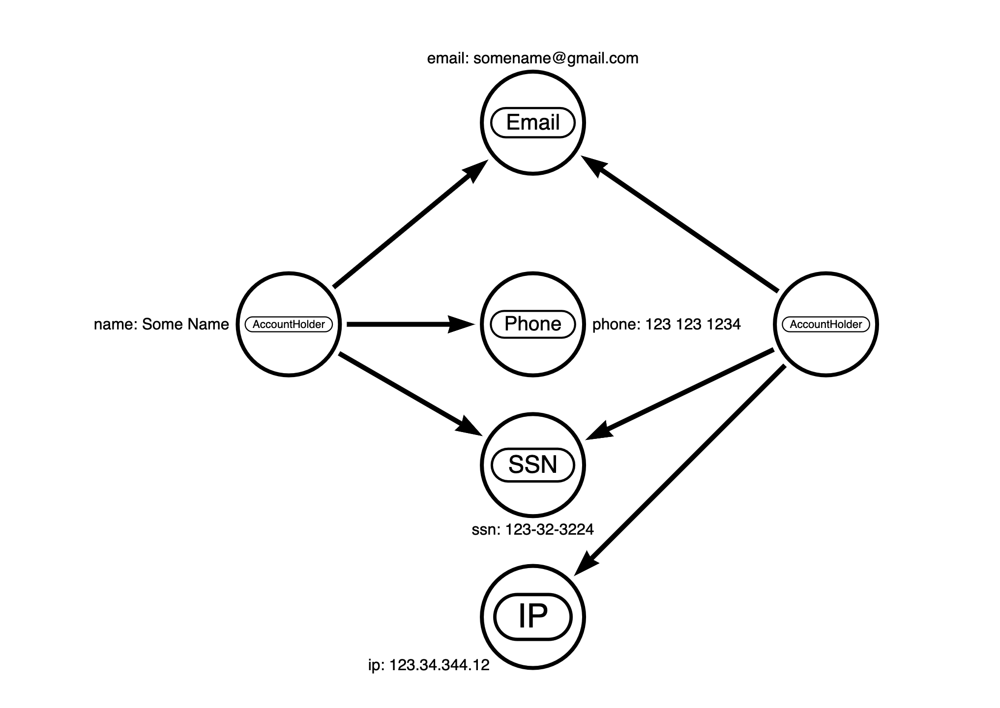

# Data Generation Examples

This folder contains example configurations

## Usage

Sample Graph can be generated using [generate_data.py](./generate_data.py)

```
python3 generate_graph_data.py examples/small-test.conf
```

## small-test.conf

Small example that shows some of the generation features, generates:
* ~30k `User` nodes
   * `age`, `amount` properties
   * sets additional `Flagged` label based on defined probability
* ~150k `FOLLOWS` relationships
   * `timestamp`, `frequency` properties


## small-incremental-test.conf

Same model as small-test, but offsets start of node IDs and generates relevant admin import configuration including output of constraints that will be needed to run the incremental import

## small-test-ratio.conf

Same model as small-test, but uses a ratio for relationship generation - `ratio_to_generate` of `5` gives 5 x no specified as `User - no_to_generate`, so ~140k follows relationships are created

## social-datagen.conf

Larger example with simple model, generates:
* ~300m `User` nodes
* ~1.5b `FOLLOWS` relationships

Go get a Coffee (or lunch..) this takes ~30 mins on my M1 MacBook


## payment-datagen.conf

generates:
* ~3.5m `AccountHolder` nodes
  * `name` properties
* ~2.5m `Phone` nodes
  * `phone` properties
* ~2.5m `Email` nodes
  * `email` properties
* ~4.5m `IP` nodes
  * `ip` properties
* ~2.5m `SSN` nodes
  * `ssn` properties

* ~4.5m `HAS_PHONE` relationships
* ~4.0m `HAS_EMAIL` relationships
* ~4.0m `HAS_IP` relationships
* ~4.0m `HAS_SSN` relationships


