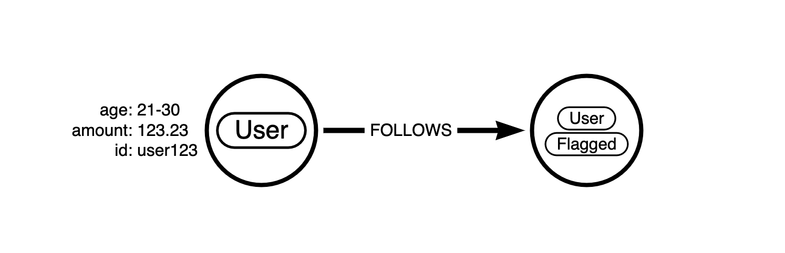
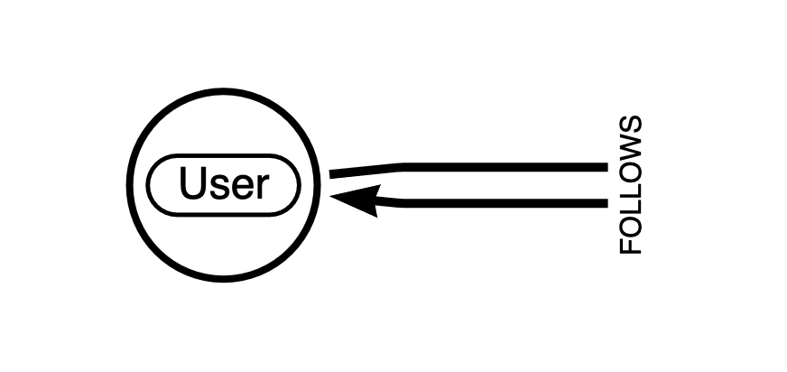

# Data Generation Examples

This folder contains example configurations

## Usage

Sample Graph can be generated using [generate_data.py](./generate_data.py)

```
python3 generate_graph_data.py examples/small-test.conf
```

## small-test.conf

Small example that shows some of the generation features, generates:
* ~30k `User` nodes
   * `age`, `amount` properties
   * sets additional `Flagged` label based on defined probability
* ~150k `FOLLOWS` relationships
   * `timestamp`, `frequency` properties



## small-incremental-test.conf

Same model as small-test, but offsets start of node IDs and generates relevant admin import configuration including output of constraints that will be needed to run the incremental import

## social-datagen.conf

Larger example with simple model, generates:
* ~300m `User` nodes
* ~1.5b `FOLLOWS` relationships



## payment-datagen.conf
